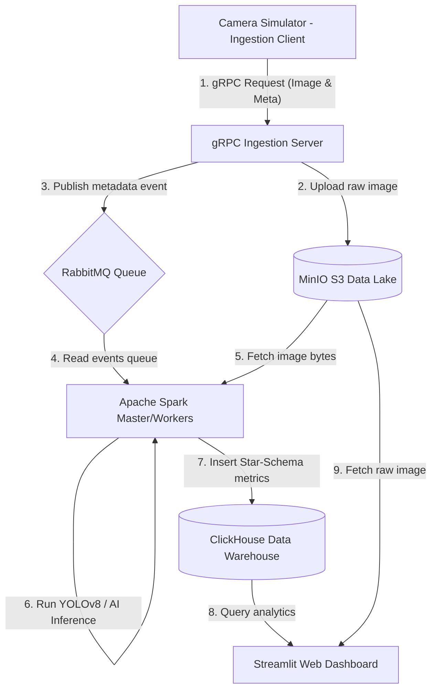

# 🚦 Smart Traffic Monitoring & Analysis Pipeline

Hệ thống phân tán tiếp nhận, xử lý và trực quan hóa lưu lượng giao thông thời gian thực từ các camera giám sát đô thị sử dụng mô hình AI (YOLOv8) và kiến trúc Event-Driven.

---

## 🌟 Tổng quan & Mục tiêu dự án

Dự án này xây dựng một hệ thống xử lý dữ liệu lớn (Big Data) để giám sát và phân tích lưu lượng giao thông đô thị từ nhiều camera giám sát thời gian thực. 

Luồng hoạt động tự động hóa của pipeline:
`Ảnh chụp camera thô -> Nhận diện AI đếm xe -> Phân tích tắc nghẽn -> Lưu trữ & Trực quan hóa Dashboard`

### Các bài toán công nghệ được giải quyết:
- **gRPC Ingestion API**: Truyền tải hình ảnh nhị phân hiệu năng cao từ camera về máy chủ, tối ưu tài nguyên mạng hơn so với REST API thông thường.
- **Data Lake (MinIO)**: Lưu trữ toàn bộ dữ liệu ảnh gốc từ các camera (Storage/Compute Separation).
- **Message Broker (RabbitMQ)**: Đóng vai trò là hàng đợi sự kiện bất đồng bộ, chống nghẽn hệ thống khi lưu lượng xe và số lượng camera tăng đột biến.
- **Distributed Computing (Apache Spark)**: PySpark điều phối việc xử lý song song. Các Spark Worker phân tích hình ảnh, sử dụng **YOLOv8** nhận diện và đếm cụ thể từng loại phương tiện (Xe máy, Ô tô, Xe buýt, Xe tải, Người đi bộ) và tính toán mức độ ùn tắc (`High`, `Medium`, `Low`).
- **Real-time Data Warehouse (ClickHouse)**: Tổ chức dữ liệu theo **Star Schema** tối ưu hóa cho các truy vấn phân tích (OLAP) với tốc độ phản hồi chỉ vài mili-giây.
- **Web Dashboard (Streamlit)**: Giao diện người dùng trực quan hóa lưu lượng giao thông thời gian thực, bản đồ số camera và truy xuất xem ảnh thực tế từ MinIO S3.
- **Orchestration (Apache Airflow)**: Tự động hóa và điều phối lịch trình chạy Spark Job.

---

## 📌 Kiến trúc hệ thống & Luồng dữ liệu



---

## 📁 Cấu trúc thư mục dự án

```text
Traffic-Monitoring-Pipeline/
├── docker-compose.yml          # Triển khai hạ tầng (ClickHouse, MinIO, RabbitMQ, Spark, Airflow)
├── requirements.txt            # Thư viện Python chạy cục bộ trên Host (Streamlit, Client, Server, CLI)
├── start_pipeline.ps1          # Kịch bản khởi động tự động (Windows PowerShell)
├── start_pipeline.sh           # Kịch bản khởi động tự động (Linux/macOS)
├── dashboard.py                # Giao diện Web Dashboard trực quan (Streamlit & Plotly)
├── clickhouse/
│   └── schema.sql              # Thiết kế Star Schema (traffic_dw) khởi tạo bảng ClickHouse
├── ingestion/
│   ├── server.py               # gRPC Ingestion Server (Nhận ảnh, lưu MinIO, đẩy RabbitMQ)
│   ├── client.py               # Camera Simulator (Giả lập 3 camera gửi ảnh theo giờ cao điểm)
│   └── protos/
│       └── image_ingestion.proto # File định nghĩa gRPC Protobuf
├── spark/
│   └── spark_job.py            # Spark Job đếm xe (YOLOv8 / Fallback Mock) và lưu ClickHouse
└── airflow/
    └── dags/
        └── image_pipeline_dag.py # Airflow DAG lập lịch điều phối Spark Job
```

---

## ⚡ Cài đặt & Vận hành nhanh (1-Click Startup)

Hệ thống đã được tối ưu hóa khởi động bằng các kịch bản chạy tự động.

### Bước 1: Chuẩn bị môi trường Python Local
Tạo môi trường ảo và cài đặt thư viện trên máy của bạn (Host):
```powershell
# Tạo virtual environment
python -m venv venv

# Kích hoạt virtual environment (Windows)
.\venv\Scripts\activate

# Cài đặt thư viện trên Host
.\venv\Scripts\python.exe -m pip install -r requirements.txt
```

### Bước 2: Khởi động hệ thống tự động
Đảm bảo **Docker Desktop** đã được mở. Sau đó chạy kịch bản tự động hóa:

* **Trên Windows (PowerShell)**:
  ```powershell
  # Kích hoạt quyền chạy script nếu cần
  Set-ExecutionPolicy -ExecutionPolicy RemoteSigned -Scope Process
  
  # Khởi động pipeline
  .\start_pipeline.ps1
  ```
* **Trên Linux / macOS / Git Bash**:
  ```bash
  chmod +x start_pipeline.sh
  ./start_pipeline.sh
  ```

*Script sẽ tự động khởi động các container Docker, cài đặt dependencies cho Spark Master, bật gRPC Ingestion Server và tự động mở giao diện Web Dashboard trên trình duyệt của bạn.*

---

## 🕹️ Chạy mô phỏng dữ liệu & Xử lý AI

Sau khi hệ thống khởi động thành công, bạn thực hiện chạy luồng dữ liệu như sau:

### Bước 1: Khởi chạy Camera Simulator (Gửi ảnh chụp camera)
Mở một terminal mới (đã kích hoạt venv) và chạy client mô phỏng gửi ảnh từ các camera Hà Nội:
```powershell
.\venv\Scripts\activate
python ingestion/client.py
```
*Client sẽ giả lập vẽ các luồng phương tiện đông đúc vào giờ cao điểm, thưa thớt lúc nửa đêm, sau đó gửi ảnh qua gRPC lên MinIO S3 và RabbitMQ.*

### Bước 2: Chạy Spark Processing Job (Đếm xe & Phân tích)
Vì lý do tương thích môi trường Java trên Windows, Spark Job được thực thi trực tiếp **bên trong container Spark Master**:
```powershell
docker exec -e MINIO_ENDPOINT=minio:9000 -e RABBITMQ_HOST=rabbitmq -e CLICKHOUSE_HOST=clickhouse -t image_pipeline_spark_master spark-submit /opt/spark-jobs/spark_job.py
```
*Spark sẽ đọc tin nhắn sự kiện từ RabbitMQ, tải ảnh từ MinIO, sử dụng mô hình đếm xe AI và ghi nhận kết quả đa chiều vào ClickHouse.*

---

## 📊 Trực quan hóa & Truy vấn dữ liệu

### 1. Web Dashboard (Streamlit)
Truy cập vào địa chỉ: **[http://localhost:8501](http://localhost:8501)**

Giao diện bao gồm:
* **Thống kê & Đồ thị**: Theo dõi tổng quan lượng xe máy, ô tô, xe buýt,... qua biểu đồ cột; xu hướng lưu lượng giao thông qua biểu đồ đường và tỷ lệ kẹt xe qua biểu đồ tròn.
* **Bản đồ giao thông**: Hiển thị vị trí tọa độ địa lý thực tế của các camera giám sát tại Hà Nội.
* **Xem ảnh chi tiết (MinIO S3)**: Chọn mã khung hình cụ thể để tải ảnh camera gốc trực tiếp từ Data Lake MinIO, hiển thị trực tiếp lên web và đối chiếu với kết quả đếm xe chi tiết của AI.

### 2. Kiểm tra dữ liệu qua Terminal CLI
Bạn cũng có thể truy vấn báo cáo nhanh thông qua CLI bằng cách chạy:
```powershell
python query_clickhouse.py
```
*Báo cáo sẽ hiển thị dạng bảng chi tiết các chiều dữ liệu và bảng Fact.*

---

## 🛠️ Thông tin kết nối các dịch vụ hạ tầng

| Dịch vụ | Địa chỉ Web UI | Tài khoản kết nối | Mật khẩu kết nối |
| :--- | :--- | :--- | :--- |
| **Streamlit Dashboard** | `http://localhost:8501` | *Không yêu cầu* | *Không yêu cầu* |
| **MinIO S3 Lake** | `http://localhost:9001` (Console) | `minioadmin` | `minioadmin` |
| **RabbitMQ Broker** | `http://localhost:15672` (Console) | `guest` | `guest` |
| **ClickHouse DW** | `http://localhost:8123` (HTTP API) | `default` | `traffic_password` |
| **Spark Cluster** | `http://localhost:8080` (Master Web) | *Không yêu cầu* | *Không yêu cầu* |
| **Airflow Orchestrator**| `http://localhost:8085` (Web UI) | `admin` | `admin` |
